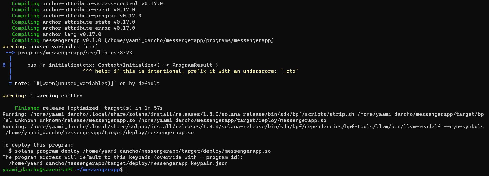
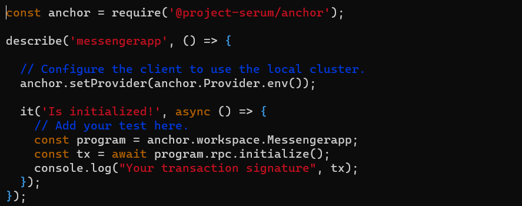
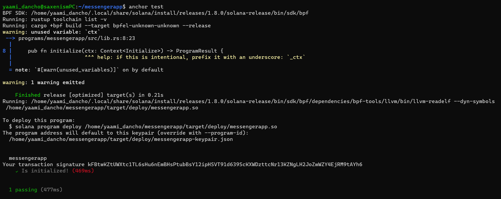
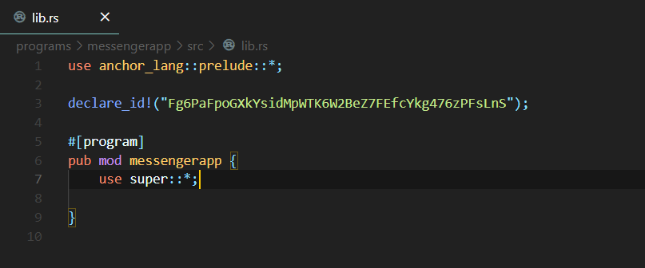
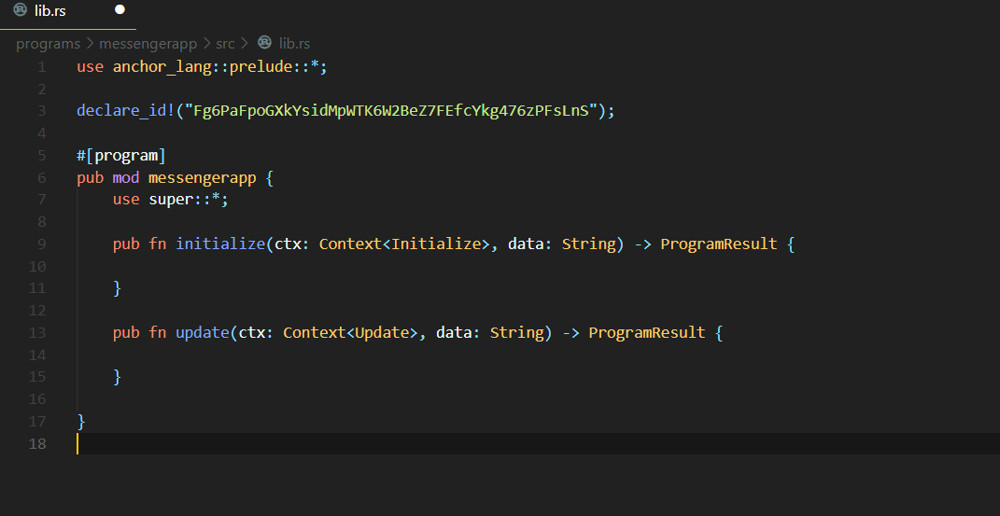
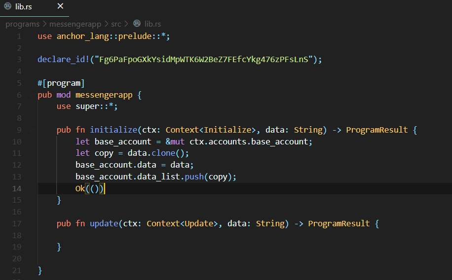
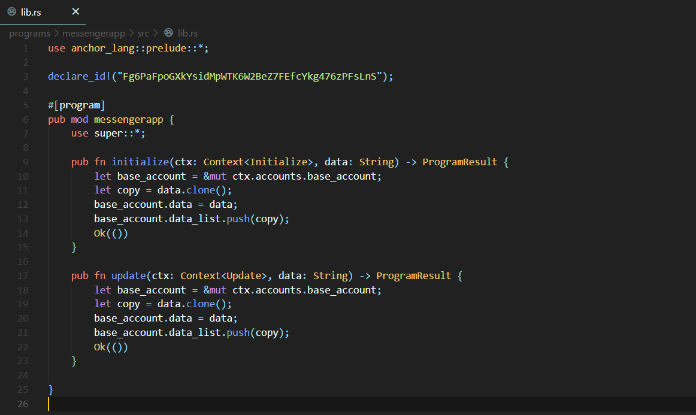

# Building a messaging app on Solana: Starting with a blockchain time capsule

Welcome to the Solana messaging app quest. With this quest you'll get upto speed with the most rapidly rising blockchain in the market: *Solana*. It would be awesome if you know a bit 
of Rust or C++ already and are familiar with how blockchains work, but even if you do not have any specific background of Rust or Solana development, we will have all bases covered. If 
you have a high level of interest and motivation, we should be good to go ahead.

In this quest, we will be developing a blockchain based time-capsule. This essentially means that you'll be able to leave a message on the Solana blockchain and anyone can view it for as
long as the Solana blockchain itself exists. Your message will survive the test of time and could not be taken down by anyone. 

This time-capsule quest will set us up for extending this project and creating an entire messaging app. How cool is that, right?

## Setting up the Environment: 

This quest could get a little cumbersome, but stick till the end and you'll thank yourself for that ;)

### Node.js

Node.js can be easily installed from [this page](https://nodejs.org/en/download/), however, we would advise using [nvm](https://github.com/nvm-sh/nvm) for downloading and managing your node versions.

### Solana Tool Suite

Solana Tool Suite is a really smooth CLI developer tooling from Solana labs and can be downloaded from [here](https://docs.solana.com/cli/install-solana-cli-tools). Note that if you are using a Windows system, the `solana-test-validator` command might not
work on your system.

### Anchor

[https://project-serum.github.io/anchor/getting-started/introduction.html]

Since Solana is still a pretty new blockchain compared to the establised ones out there, it's developer tooling too is pretty limited and cumbersome as of now. However, it is rapidly improving 
and it does so on a daily basis. At the forefront of this development is Anchor, by [Armani Ferrante](https://twitter.com/armaniferrante). You can think of it like the Ruby on Rails framework for
Ruby, that means yes, you can develop things on vanilla Ruby, but Ruby on Rails makes your life much much easier, right? That's the same with Anchor and Solana development. Anchor is the Hardhat of 
Solana development plus much more. It offers a Rust DSL (basically, an easier Rust) to work with along with IDL, CLI and workspace management. 

#### Installation:

Installing Anchor should be straight-forward if you follow the instructions given [here](https://project-serum.github.io/anchor/getting-started/installation.html)

**Fair Warning** : If you are using a Windows system, we highly suggest using [WSL2](https://en.wikipedia.org/wiki/Windows_Subsystem_for_Linux) (Windows sub-system for Linux) or switching to a Linux environment. Setting up WSL is also quick and easy. A 
good walk-through can be found [here](https://www.youtube.com/watch?v=X3bPWl9Z2D0&ab_channel=BeachcastsProgrammingVideos)

### Phantom Wallet:

Follow the instructions over at the [Phantom website](https://phantom.app/) to download a browser that will help us interact with our Solana programs.

## Running configurations on Solana CLI

The first command you should run on your terminal (assuming Solana CLI was properly installed in the last quest) is:

```
solana config get
```

This should throw up a result similar to something like: 


If you didnot set up your keypair earlier, then you won't be having the `Keypair Path` in your results. To set that up, follow the instructions over [here](https://docs.solana.com/wallet-guide/paper-wallet#seed-phrase-generation)

We would want to remain on the local network for building our program and later shift to the devent or mainnet-beta if required. If the `RPC URL` field of your last result did not show `localhost`, you can set it to localhost using the following command:

```
solana config set --url localhost
```

Next, we would want to know our account/wallet address and airdrop some SOL tokens into it, to handle all the deployment, transactions etc costs that come with interacting with and using a Solana program. To do that first let's find our address. The command to do that is:
```
solana address
```

This would result into something like this:


Then, for more comprehensive details of your account, use the following command with the address that you got from the last command
```
solana account <your address from the last command>
```

This would result into something like this:


Next, we want to spin up our local network. Think of this local network as a mock Solana blockchain running on your own single system. This network would be required for development and testing of our program. To spin it up, in a separate tab, use the following command:
```
solana-test-validator
```

Once you get an image, like the one below, you know that your local validator (local network) is now up and running


Now, our last task is to top up our account with some SOL, which you can do by using:

```
solana airdrop 100
```

This should result in something like:


## Setting up our Anchor project

In this sub-quest all we would do is initialize an Anchor project and see whether everything's there and working fine or not and after move on ahead to make our own changes.
Head over to your preferred destination for the project using your terminal and then type the following command:
```
anchor init messengerapp

cd messengerapp
``` 

This would result in a screen somewhat similar to this:


First we check whether we can see the *programs*, *app*, *programs*, *migrations* directory among others or not. If we can, we would head over to *programs/messengerapp/src/lib.rs* to see the default program that Anchor provides us. This is the most basic example possible on Anchor and what's happening here is simply that a user-defined function `Initialize` whenever called would successfully exit the program. That's all, nothing fancy. Now, let's try to compile this program using the following command:

```
anchor build
```

This would trigger a build function and would something like this upon completion:



This build creates a new folder in your project directory called, `target`. This `target` folder contains the `idl` directory, which would also contain the `idl` for our program. The `IDL` or Interface Description Language describes the instructions exposed by the contract and is very similar to ABI in Solidity and user for similar purposes, ie, for tests and front-end integrations. Next, we can move onto testing this program, so that we can get familiar with how testing is done in Anchor. Head to `tests/messengerapp.js`. Here, you'll see a test written in javascript to interact and test the default program. There are a lot of things in the test, that may not make sense to you right now, but stick around and we'll get to those shortly. The test would look something like this:



Next, to actually run these tests, first head over to the tab where you ran the solana-test-validator command and kill that process (using Ctrl-C). Now, use the following command:

```
anchor test
```

The passing tests should result in the following screen:



Now, let's head over to the `programs` directory again and start making changes to create our messaging app.

## Writing our first program function

Head over to `programs/messengerapp/src/lib.rs` and clear the code written there apart from the macro declarations and crates (libraries) that we will be using. After the clearning, your coding screen should look somehting like this:



Now let us simply define two functions that we will be using in our Solana program. The bulk of the program goes in a module under the `#[program]` macro. We'll just define them under the `pub mod messengerapp` and write the logic later. These two function definitions would look like this:
```
    pub fn initialize(ctx: Context<Initialize>, data: String) -> ProgramResult {
        
    }

    pub fn update(ctx: Context<Update>, data: String) -> ProgramResult {
        
    }
```
Here `pub` means public and `fn` means function, implying that they are public functions that can be invoked from our program, ie it becomes a client-callable program function. The first argument of these functions is always `Context<T>` which consist of the solana accounts array and the program ID, which in essence is the required data to call just about any progarm on Solana. The next parameter of both these functions is a `String` named data, which we will be using as our message. The `ProgramResult` is the return type of both these functions, which actually is just an easier method to serve function results and/or errors.

After defining the above two functions, your code should look something like this:



Now, let's write our logic for the `initialize` function, ok? Let's first make our intentions clear for this function and the program in general. We want to keep track of two things here. First, is the data that is being passed while calling the function and the second is the list of all the data(messages) that have been passed to our specific account. So, we would want our main account (the account that will handle all the messaging stuff of the program) to have two fields, one for storing the incoming data and the other for keeping a record of all earlier data. We call this account the `base_account`. Also, keep in mind that since we will be adding to the data_list everytime a new data is introduced, we will need the account to be mutable, ie, the account should be able to accept changes. Write the following logic inside the `initialize` function now:

```
let base_account = &mut ctx.accounts.base_account;
let copy = data.clone();
base_account.data = data;
base_account.data_list.push(copy);
Ok(())
```
The `Ok(())` syntax is used for error handling of the ProgramResult type. You can think of `Ok(())` like a gate, that lets the program continue if there are no errors but sends the program into another state if an error is encountered.  

Now, your coding screen should look something like this: 


### A small note about Accounts on Solana:
An account is not actually a wallet. Instead, it’s a way for the contract to persist data between calls. This includes information such as the count in our base_account, and also information about permissions on the account. Accounts pay rent in the form of lamports, and if it runs out, then the account is purged from the blockchain. Accounts with two years worth of rent attached are “rent-exempt” and can stay on the chain forever.

## Writing out our second function

In the last sub-quest we defined the `update` function, right? Now let's go ahead and write the logic for this function. 

```
let base_account = &mut ctx.accounts.base_account;
let copy = data.clone();
base_account.data = data;
base_account.data_list.push(copy);
Ok(())
```

Your code screen should now look like this:


Wasn't this funny? We wrote the same code again, right? Well, yes, the logic of both the functions were same and the only real difference is in the `struct` inside of the `Context<>` class. This essentially is what would differentiate between whether the message coming in our program is the first message or some later messages. Now, the natural question would be where are all these `structs` defined? Calm down, champ. We haven't yet defined them, but that is exactly what we will be doing next.

## Defining the structs used in our program
